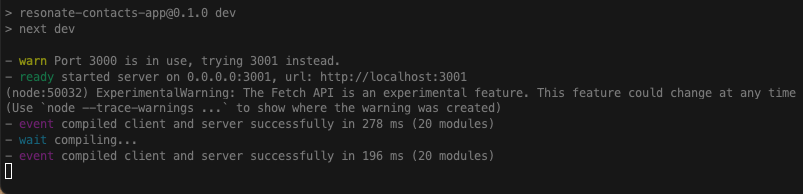

This is a simple contacts application created for the technical challenge sent as part of an application for a Software Engineer Intership at [Resonate AI](https://www.resonate.com/). It was built with [Next.js](https://nextjs.org/) and bootstrapped with [create-next-app](https://github.com/vercel/next.js/tree/canary/packages/create-next-app). Styling for the application was implemented using [Chakra-UI](https://chakra-ui.com/).

## Links

🌏 Deployed Application: [https://resonate-contacts-app.vercel.app/](https://resonate-contacts-app.vercel.app/)

💾 Github Repository: [https://github.com/MarioLisbona/resonate-contacts-app](https://github.com/MarioLisbona/resonate-contacts-app)

## Installation Instructions

1. Create a directory called `contacts-app` and navigate into that directory.

- `$ mkdir contacts-app && cd contacts-app`

2. Once in the `/contacts-app` directory, in the terminal run the following command:

- `git clone git@github.com:MarioLisbona/resonate-contacts-app.git`

- Navigate to the client folder:

- `$ cd resonate-contacts-app`
- Install npm packages

- `npm install --legacy-peer-deps`

- run the server with the following command:

- `npm run dev`

- By default the server will run at `http://localhost:3000/` however if this port is already in use another port will be provided.

- You will also be provided a link in the terminal to the port where the client server is running:

  

You will now be able to view all the Contacts in the App.

- Run the command `ctrl+c` to kill the server.

Enjoy 😊
